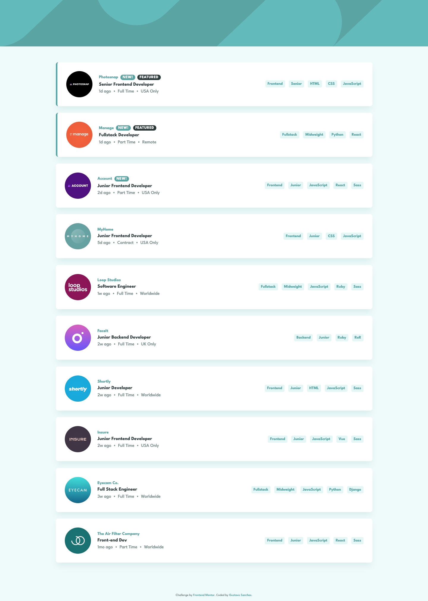
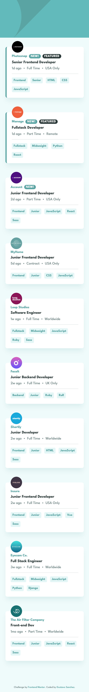

# Frontend Mentor — Job Listings with Filtering

A responsive job listing page that lets users filter positions by role, level, languages, and tools — built as a [Frontend Mentor challenge](https://www.frontendmentor.io/challenges/job-listings-with-filtering-ivstIPCt) using React 19, TypeScript, and Vite.


---

## Table of Contents

- [Overview](#overview)
- [Screenshots](#screenshots)
- [Links](#links)
- [My Process](#my-process)
  - [Built With](#built-with)
  - [Project Structure](#project-structure)
  - [What I Learned](#what-i-learned)
  - [Continued Development](#continued-development)
  - [Useful Resources](#useful-resources)
  - [AI Collaboration](#ai-collaboration)
- [Testing](#testing)
- [Getting Started](#getting-started)
- [Roadmap](#roadmap)
- [Author](#author)
- [Acknowledgments](#acknowledgments)

---

## Overview

### The Challenge

Users should be able to:

- View the optimal layout for the site depending on their device's screen size (375px · 768px · 1440px)
- See hover states for all interactive elements on the page
- Click tag pills to add them as active filters
- Filter job listings based on multiple categories simultaneously (all filters must match)
- Remove individual filters or clear all with a single click

### Screenshots

**Desktop (1440px)**



**Mobile (375px)**



### Links

- **Solution URL:** [github.com/gusanchefullstack/fsdev-job-listings-with-filtering](https://github.com/gusanchefullstack/fsdev-job-listings-with-filtering)
- **Live Site:** [fsdev-job-listings-with-filtering-d.vercel.app](https://fsdev-job-listings-with-filtering-d.vercel.app)

---

## My Process

### Built With

- **React 19** — component-based UI with hooks (`useState`)
- **TypeScript** — typed props and data interfaces
- **Vite** — fast dev server and optimised production build
- **CSS Modules** — component-scoped styles with zero naming conflicts
- **CSS Custom Properties** — centralised design tokens for colours and typography
- **Flexbox** — card layouts and tag rows
- **Semantic HTML5** — `<header>`, `<main>`, `<aside>`, `<article>`, `<section>`, `<footer>`
- **WCAG best practices** — `aria-label`, `aria-hidden`, `focus-visible` outlines, screen-reader-only text

### Project Structure

```
src/
├── __tests__/
│   └── App.test.tsx      # Integration tests (filter state end-to-end)
├── components/
│   ├── FilterBar/        # Active-filter chip strip with remove + clear
│   │   └── __tests__/FilterBar.test.tsx
│   ├── FilterTag/        # Clickable tag pill (adds to filter list)
│   │   └── __tests__/FilterTag.test.tsx
│   ├── Header/           # Decorative hero with SVG wave background
│   ├── JobCard/          # Individual listing card (featured border, logo overlap)
│   │   └── __tests__/JobCard.test.tsx
│   └── JobList/          # Renders the filtered card collection
│       └── __tests__/JobList.test.tsx
├── data/
│   └── jobs.ts           # Typed re-export of data.json
├── test/
│   └── setup.ts          # jest-dom matchers setup
├── types/
│   └── job.ts            # Job interface
├── utils/
│   ├── filterJobs.ts     # Pure filter logic (getJobTags, filterJobs)
│   └── __tests__/filterJobs.test.ts
├── App.tsx               # Filter state + derived filtered list
├── App.module.css
├── index.css             # Global reset + CSS custom properties
└── main.tsx
public/
└── images/               # SVG company logos and header backgrounds
screenshots/
├── desktop-1440px.png
└── mobile-375px.png
```

### What I Learned

#### 1. CSS Custom Properties as a design-token layer

Centralising every colour and weight in `:root` made it trivial to stay consistent across 10+ component files without any pre-processor:

```css
:root {
  --color-primary: hsl(180, 29%, 50%);
  --color-bg:      hsl(180, 52%, 96%);
  --color-gray:    hsl(180, 8%,  52%);
  --color-dark:    hsl(180, 14%, 20%);
}
```

#### 2. CSS Modules with dynamic class composition

Conditionally applying a second class in JSX without a utility library keeps template code readable:

```tsx
<article className={`${styles.card} ${job.featured ? styles.featured : ''}`}>
```

#### 3. Logo-overlap effect on mobile

On screens < 768 px the company logo sits half-outside the card's top edge. This is achieved purely with `position: absolute` and a negative `top` value, while the card gets `margin-top` to reserve space:

```css
/* card gets space for the protruding logo */
.card    { margin-top: 2.5rem; }
/* logo floats above the card */
.logoWrapper { position: absolute; top: -24px; left: 1.5rem; }
```

#### 4. Filter-bar overlap with `translateY`

The active-filter strip visually overlaps the teal header using CSS `transform` so the hero graphic remains a simple, self-contained element:

```css
.filterWrapper { transform: translateY(-36px); margin-bottom: -36px; }
```

#### 5. Derived state — filtering without a reducer

A single `activeFilters: string[]` state is all that's needed. The filtered list is a plain derivation — no `useReducer`, no extra effects:

```ts
const allTags = (job: Job) => [job.role, job.level, ...job.languages, ...job.tools];
const filteredJobs = jobs.filter(job =>
  activeFilters.every(f => allTags(job).includes(f))
);
```

#### 6. Accessible interactive elements

All tag buttons carry `aria-label="Filter by ${label}"` and every remove button carries `aria-label="Remove ${tag} filter"`, so screen-reader users hear the full action context rather than just "button".

### Continued Development

- Add URL-based filter persistence so sharing a filtered URL shows the same results
- Add animated transitions when cards enter/leave the filtered list (e.g. `@starting-style` or Framer Motion)
- Explore `View Transitions API` for the filter-bar appearance

### Useful Resources

- [CSS Custom Properties — MDN](https://developer.mozilla.org/en-US/docs/Web/CSS/--*) — the authoritative reference for design token patterns
- [React Docs — Deriving state](https://react.dev/learn/choosing-the-state-structure#avoid-redundant-state) — confirmed that computing `filteredJobs` inline is idiomatic
- [CSS Modules Docs](https://github.com/css-modules/css-modules) — understanding the `composes` keyword and local/global scoping
- [WCAG 2.1 — Link Purpose](https://www.w3.org/WAI/WCAG21/Understanding/link-purpose-in-context.html) — guided the unique `aria-label` approach for filter buttons

### AI Collaboration

This project was built in collaboration with **Claude Sonnet 4.6** (Anthropic) via Claude Code:

- **Planning** — Claude analysed the Figma designs and generated a structured implementation plan covering components, state shape, responsive breakpoints, and commit sequence. The plan was reviewed and approved before any code was written.
- **Scaffolding** — Since `npm create vite` requires an empty directory, Claude hand-crafted the Vite + TypeScript config files and wired up the project from scratch.
- **CSS precision** — Claude translated design specs (logo overlap, filter-bar translateY, featured border) into working CSS after reviewing the reference screenshots side-by-side.
- **What worked well** — The plan-before-code workflow prevented rework; browser automation let Claude verify hover states, filter logic, and responsive layouts at exact breakpoints without leaving the terminal.
- **What to watch** — AI-generated CSS sometimes needs a second pass at exact pixel values — always verify visually rather than trusting computed estimates alone.

---

## Testing

The project uses **Vitest** and **React Testing Library** for unit and integration tests.

```bash
npm test          # single run
npm run test:watch  # watch mode
```

**38 tests across 6 test files:**

| File | Tests | Coverage |
|---|---|---|
| `utils/__tests__/filterJobs.test.ts` | 11 | `getJobTags`, `filterJobs` — AND logic, empty arrays, language/tool matching |
| `components/FilterTag/__tests__/FilterTag.test.tsx` | 3 | Renders, aria-label, click callback |
| `components/FilterBar/__tests__/FilterBar.test.tsx` | 6 | Empty state, chips, remove per tag, clear button |
| `components/JobCard/__tests__/JobCard.test.tsx` | 7 | All fields, New/Featured badges, tag list, logo alt |
| `components/JobList/__tests__/JobList.test.tsx` | 3 | Card count, empty state, callback pass-through |
| `__tests__/App.test.tsx` | 8 | Initial load, add/remove/clear filters, no-dup, AND logic |

---

## Getting Started

### Prerequisites

- Node.js ≥ 18
- npm ≥ 9

### Installation

```bash
# Clone the repo
git clone https://github.com/gusanchefullstack/fsdev-job-listings-with-filtering.git
cd fsdev-job-listings-with-filtering

# Install dependencies
npm install

# Start the dev server
npm run dev
```

Open `http://localhost:5173` in your browser.

### Build for Production

```bash
npm run build   # outputs to dist/
npm run preview # local preview of the production build
```

---

## Roadmap

- [x] Desktop layout (1440px)
- [x] Tablet layout (768px)
- [x] Mobile layout (375px) with logo overlap
- [x] Clickable tag pills add filters
- [x] Active filter bar overlaps hero header
- [x] Remove individual filters / Clear all
- [x] Hover states on all interactive elements
- [x] Accessible markup (ARIA labels, focus-visible)
- [x] Unit tests with Vitest (38 tests, 6 files)
- [ ] URL-based filter persistence
- [ ] Animated card enter/leave transitions

---

## Author

[](https://www.linkedin.com/in/gustavosanchezgalarza/)
[](https://github.com/gusanchefullstack)
[](https://hashnode.com/@gusanchedev)
[](https://x.com/gusanchedev)
[](https://bsky.app/profile/gusanchedev.bsky.social)
[](https://www.freecodecamp.org/gusanchedev)
[](https://www.frontendmentor.io/profile/gusanchefullstack)

---

## Acknowledgments

- [Frontend Mentor](https://www.frontendmentor.io) — for the challenge design and assets
- [League Spartan](https://fonts.google.com/specimen/League+Spartan) — the typeface used throughout the UI
- [Vite](https://vitejs.dev) — blazing fast dev experience that made iteration enjoyable
